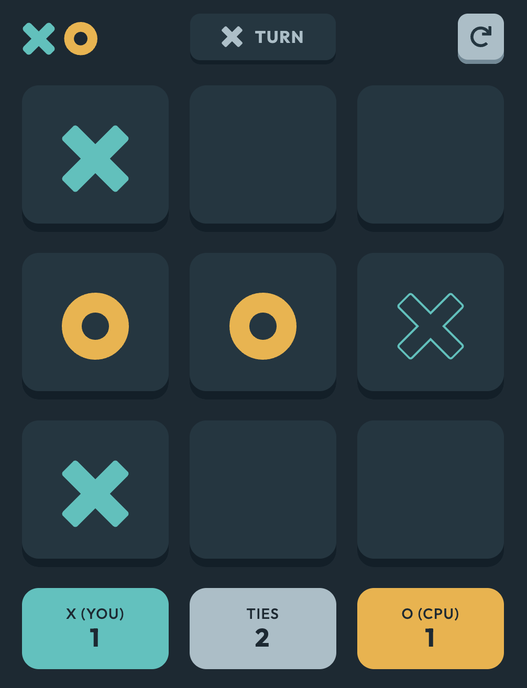
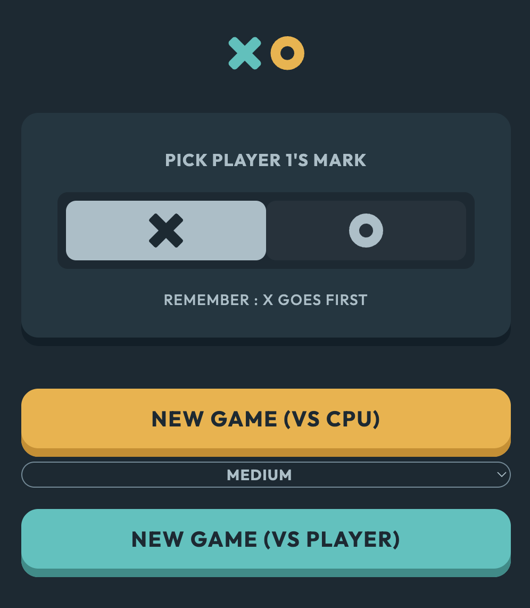
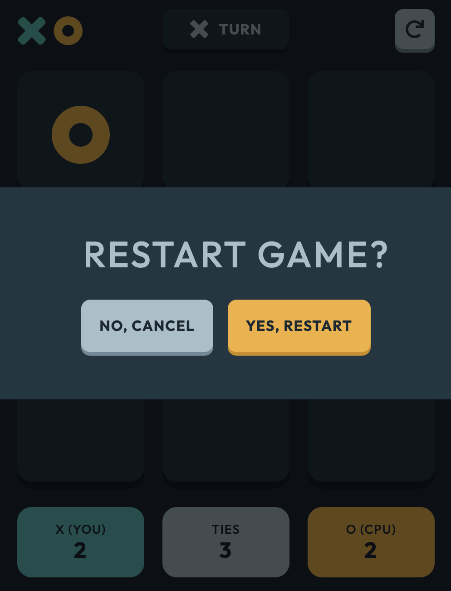
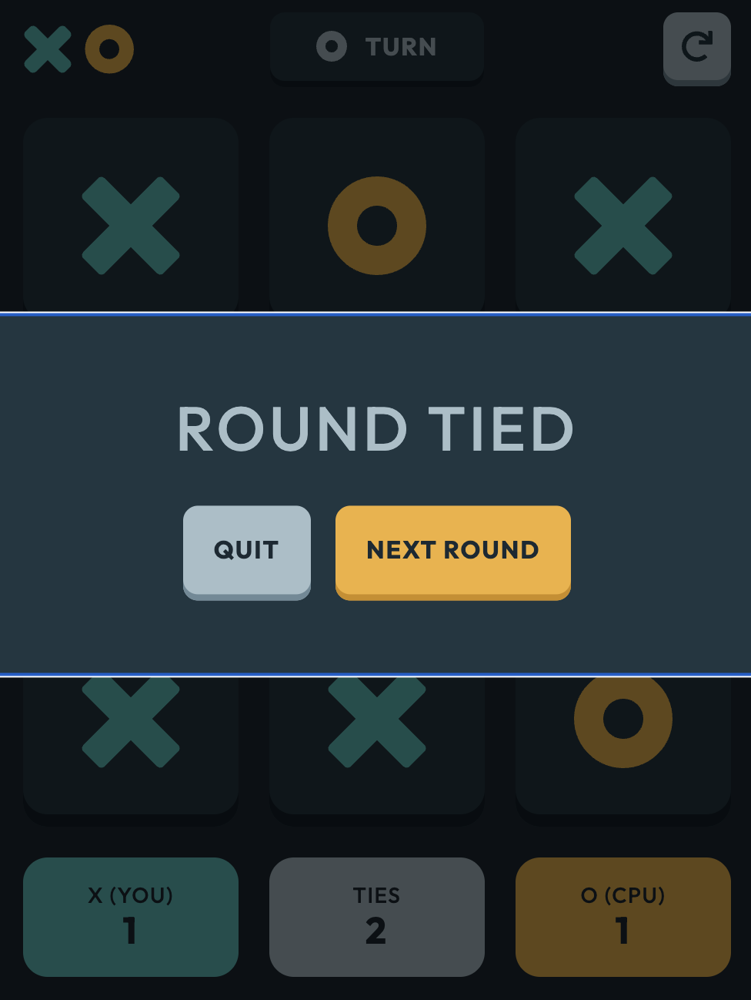
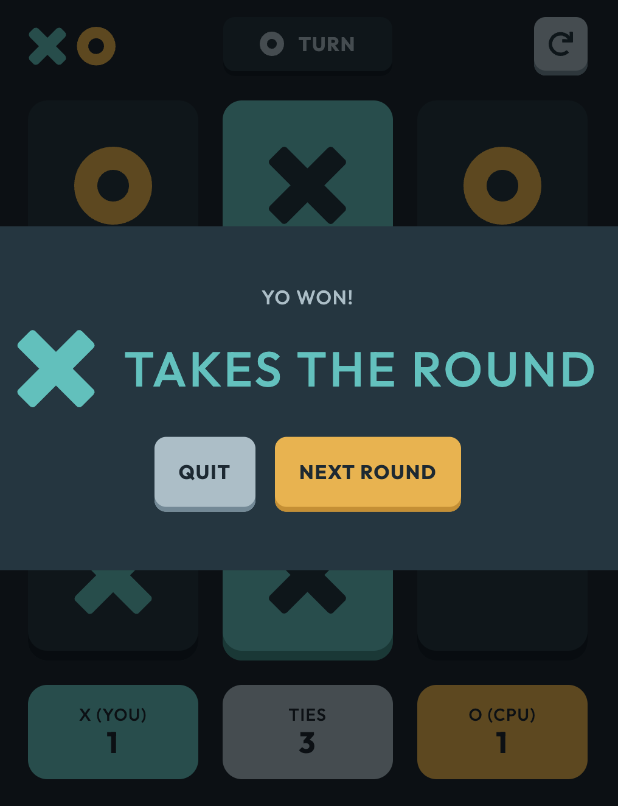
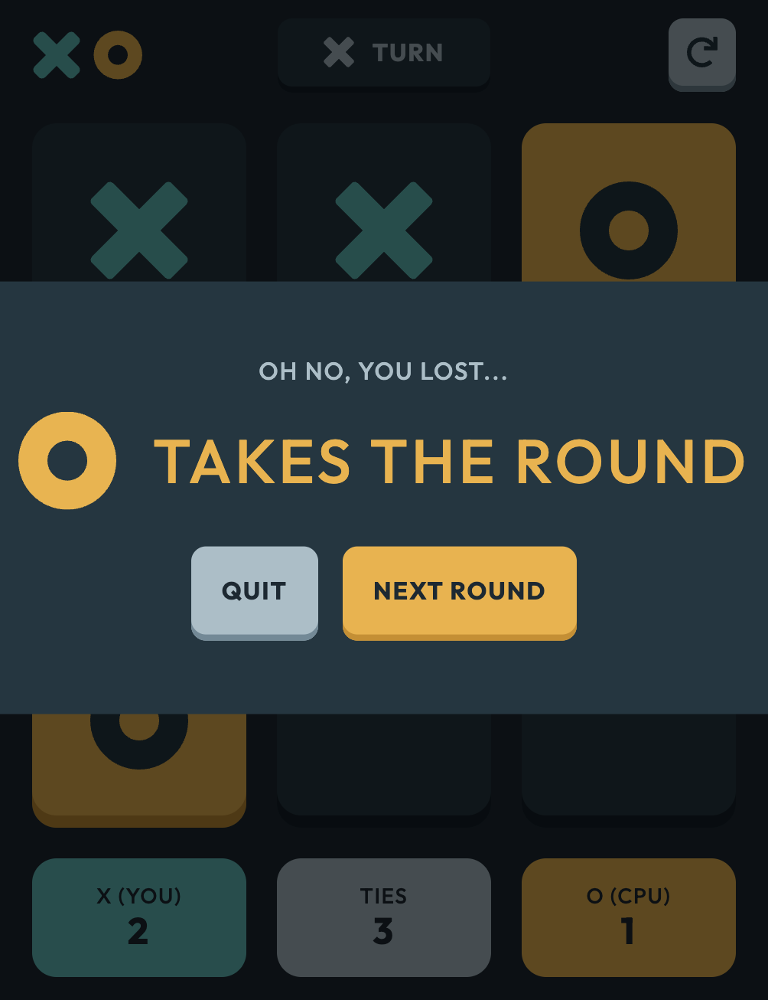

# Tic Tac Toe With TypeScript

## Overview

Thanks for checking out this front-end coding challenge.

This is a classic Tic Tac Toe game featuring multiplayer or VS CPU game modes, along with various difficulty settings.

[Live Demo](https://emretantu.github.io/tic-tac-toe-typescript/)

## Table of Contents
- [Project source](#project-source)
- [The challenge](#the-challenge)
- [Screenshot](#screenshot)
- [Links](#links)
- [Built with (tech-stack)](#built-with-tech-stack)
- [What you need to know](#what-you-need-to-know)
- [Author](#author)

## Project source

This is a Frontend Mentor project. You can find the details under [Useful resources](#useful-resources).

## The challenge

Users should be able to:

- View the optimal layout for the game depending on their device's screen size
- See hover states for all interactive elements on the page
- Play the game either solo vs the computer or multiplayer against another person
- **Bonus 1**: Save the game state in the browser so that it’s preserved if the player refreshes their browser
- **Bonus 2**: Instead of having the computer randomly make its moves, try making it clever so it’s proactive in blocking your moves and trying to win
- **Bonus 3**: If your "clever" approach uses the **Minimax algorithm**, the human player will have no chance of winning; they will either tie or lose. To overcome this, you can adjust the Minimax logic to allow for human wins and even implement different difficulty modes.

**Expected behavior**

- You can choose to make the default screen either the new game menu or the solo player game board. Note that we're using the solo player game board for the design screenshot, so if you choose the new game menu it won't match up in the design comparison slider. This isn't a big deal, but is something worth considering.
- On the new game screen, whichever mark isn't selected for the first player is automatically assigned to the second player when the game is started.
- The first turn of the first round is always played by whoever is playing as X. For every following round, the first turn alternates between O and X.
- After a round, if the player chooses to quit the game, they should be taken back to the new game menu.
- If the restart icon in the top right is clicked, the "Restart game?" modal should show and allow the player to reset the game or cancel and continue to play.

## Screenshot

  

  

## Links

- [Live Demo](https://emretantu.github.io/tic-tac-toe-typescript/)
- [Frontend Mentor Tic Tac Toe Challenge](https://www.frontendmentor.io/challenges/tic-tac-toe-game-Re7ZF_E2v)

## Built with (tech stack)

- HTML
- CSS
- TypeScript

## What You Need to Know

- The tech stack listed above
- TS concepts and features

## Author

**Emre Tantu**
- Website - [emretantu.dev](https://www.emretantu.dev)
- Contact - [hello@emretantu.dev](mailto:hello@emretantu.dev)
- LinkedIn - [in/emretantu](https://www.linkedin.com/in/emretantu/)
- Twitter - [@emretantu](https://www.twitter.com/emretantu)

---
---

# 🇹🇷 TypeScript ile Tic Tac Toe

## Genel Bakış

Bu front-end coding challenge projesine göz attığınız için teşekkürler.

Bu proje, multiplayer veya CPU'ya karşı oyun modları ve zorluk seçenekleri sunan klasik bir Tic Tac Toe oyunudur.

[Live Demo](https://emretantu.github.io/tic-tac-toe-typescript/)

## İçindekiler
- [Proje kaynağı](#proje-kaynagi)
- [İsterler (Gereksinimler)](#isterler-gereksinimler)
- [Ekran Görüntüleri](#ekran-goruntuleri)
- [Linkler](#linkler)
- [Kullanılan Teknolojiler](#kullanilan-teknolojiler)
- [Bilmeniz Gerekenler](#bilmeniz-gerekenler)
- [Yazar](#yazar)

## Proje kaynağı

Bu bir Frontend Mentor projesidir. Detayları [Useful resources](#useful-resources) altında bulabilirsiniz.

## İsterler (Gereksinimler)

Kullanıcı şunları yapabilmelidir:

- Cihaz ekran boyutuna göre optimize edilmiş **layout**'u görebilmeli.
- Sayfadaki tüm interaktif elementler için **hover state**'lerini görebilmeli.
- Oyunu bilgisayara karşı (solo) veya başka birine karşı (multiplayer) oynayabilmeli.
- **Bonus 1**: Oyunun durumunu (**state**) tarayıcıda kaydedebilmeli, böylece sayfa yenilendiğinde ilerleme korunmalı.
- **Bonus 2**: Bilgisayarın rastgele hamle yapması yerine, hamleleri önceden sezip engelleyen ve kazanmaya çalışan zeki bir mantık kurgulanmalı.
- **Bonus 3**: Eğer zeki yönteminiz **Minimax algoritması** ise, insan oyuncunun kazanma şansı olmayacaktır; ya berabere kalacak ya da kaybedecektir. Bu durumu aşmak için **Minimax** mantığını esnetebilir ve farklı zorluk modları ekleyebilirsiniz.

**Beklenen Davranışlar**

- Varsayılan ekranı "Yeni Oyun Menüsü" veya "Solo Oyun Tahtası" olarak seçebilirsiniz. (Ekran görüntülerinde solo tahta kullanıldığı için tasarım karşılaştırmasında bu durum dikkate alınmalıdır).
- Yeni oyun ekranında, birinci oyuncu için seçilmeyen işaret, oyun başladığında otomatik olarak ikinci oyuncuya atanır.
- İlk turun ilk hamlesini her zaman X olarak oynayan yapar. Sonraki her turda, ilk hamle O ve X arasında değişir.
- Bir turdan sonra, oyuncu oyundan çıkmak isterse ana menüye yönlendirilmelidir.
- Sağ üstteki **restart** ikonuna tıklandığında, "Oyunu sıfırla?" (**Restart game?**) **modal**'ı görünmeli; oyuncu oyunu sıfırlayabilmeli veya iptal edip devam edebilmeli.

## Ekran Görüntüleri

  

  

## Linkler

- [Live Demo](https://emretantu.github.io/tic-tac-toe-typescript/)
- [Frontend Mentor Tic Tac Toe Challenge](https://www.frontendmentor.io/challenges/tic-tac-toe-game-Re7ZF_E2v)

## Kullanılan Teknolojiler

- HTML
- CSS
- TypeScript

## Bilmeniz Gerekenler

- Yukarıdaki **tech stack** bilgisi.
- TypeScript konseptleri ve özellikleri.

## Yazar

**Emre Tantu**
- Website - [emretantu.dev](https://www.emretantu.dev)
- İletişim - [hello@emretantu.dev](mailto:hello@emretantu.dev)
- LinkedIn - [in/emretantu](https://www.linkedin.com/in/emretantu/)
- Twitter - [@emretantu](https://www.twitter.com/emretantu)